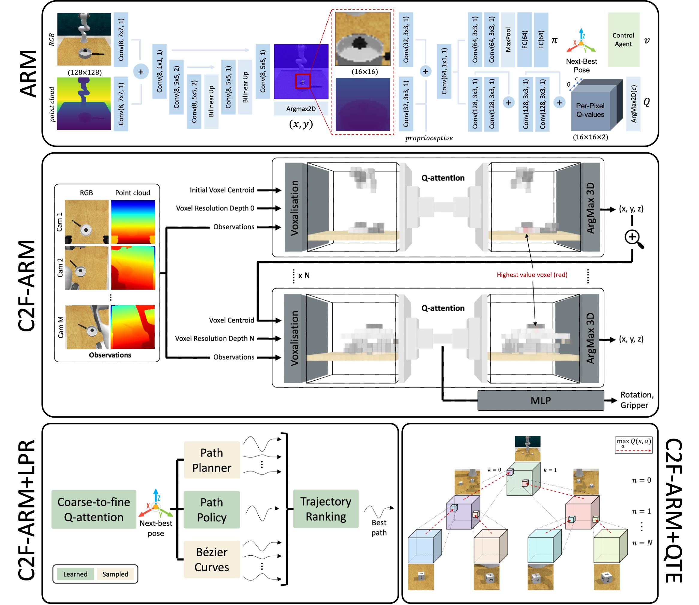

# Attention-driven Robotic Manipulation (ARM)

Codebase of Q-attention, coarse-to-fine Q-attention, and other variants. Code from the following papers:

- [Q-attention: Enabling Efficient Learning for Vision-based Robotic Manipulation](https://arxiv.org/abs/2105.14829) (ARM system)
- [Coarse-to-Fine Q-attention: Efficient Learning for Visual Robotic Manipulation via Discretisation](https://arxiv.org/abs/2106.12534) (C2F-ARM system)
- [Coarse-to-Fine Q-attention with Learned Path Ranking](https://arxiv.org/abs/2204.01571) (C2F-ARM+LPR system)
- [Coarse-to-Fine Q-attention with Tree Expansion](https://arxiv.org/abs/2204.12471)




## Installation

ARM is trained using the **YARR framework** and evaluated on **RLBench** 1.1.0.

Install all of the project requirements:
```bash
# Create conda environment
conda create -n arm python=3.8

# Install PyTorch 2.0. Go to PyTorch website to install other versions.
conda install pytorch=2.0 torchvision torchaudio pytorch-cuda=11.7 -c pytorch -c nvidia

# Install YARR
pip install git+https://github.com/stepjam/YARR.git

# Install CoppeliaSim 4.1.0 for Ubuntu 20.04
# Refer to PyRep README for other versions
export COPPELIASIM_ROOT=${HOME}/.local/bin/CoppeliaSim
curl -O https://www.coppeliarobotics.com/files/CoppeliaSim_Edu_V4_1_0_Ubuntu20_04.tar.xz
mkdir -p $COPPELIASIM_ROOT && tar -xf CoppeliaSim_Edu_V4_1_0_Ubuntu20_04.tar.xz -C $COPPELIASIM_ROOT --strip-components 1
## Add environment variables into bashrc (or zshrc)
echo "export COPPELIASIM_ROOT=$COPPELIASIM_ROOT
export LD_LIBRARY_PATH=\$LD_LIBRARY_PATH:\$COPPELIASIM_ROOT
export QT_QPA_PLATFORM_PLUGIN_PATH=\$COPPELIASIM_ROOT" >> ~/.bashrc

# Install PyRep
git clone https://github.com/stepjam/PyRep.git .local/PyRep
cd .local/PyRep
pip install -r requirements.txt
pip install .
cd ../..

# Install RLBench
git clone https://github.com/stepjam/RLBench.git .local/RLBench
cd .local/RLBench
pip install -r requirements.txt
pip install .
cd ../..

# Install ARM dependencies
pip install -r requirements.txt
```

## Running experiments

Be sure to have RLBench demos saved on your machine before proceeding. To generate demos for a task, go to the 
tools directory in RLBench _(rlbench/tools)_, and run:
```bash
python dataset_generator.py --save_path=/mnt/my/save/dir --tasks=take_lid_off_saucepan --image_size=128,128 \
--renderer=opengl --episodes_per_task=100 --variations=1 --processes=1
```


Experiments are launched via [Hydra](https://hydra.cc/). To start training **C2F-ARM** on the 
**take_lid_off_saucepan** task with the default parameters on **gpu 0**:
```bash
python launch.py method=C2FARM rlbench.task=take_lid_off_saucepan rlbench.demo_path=/mnt/my/save/dir framework.gpu=0
```

To launch **C2F-ARM+LPR**:
```bash
python launch.py method=LPR rlbench.task=take_lid_off_saucepan rlbench.demo_path=/mnt/my/save/dir framework.gpu=0
```

To launch **C2F-ARM+QTE**:
```bash
python launch.py method=QTE rlbench.task=take_lid_off_saucepan rlbench.demo_path=/mnt/my/save/dir framework.gpu=0
```
